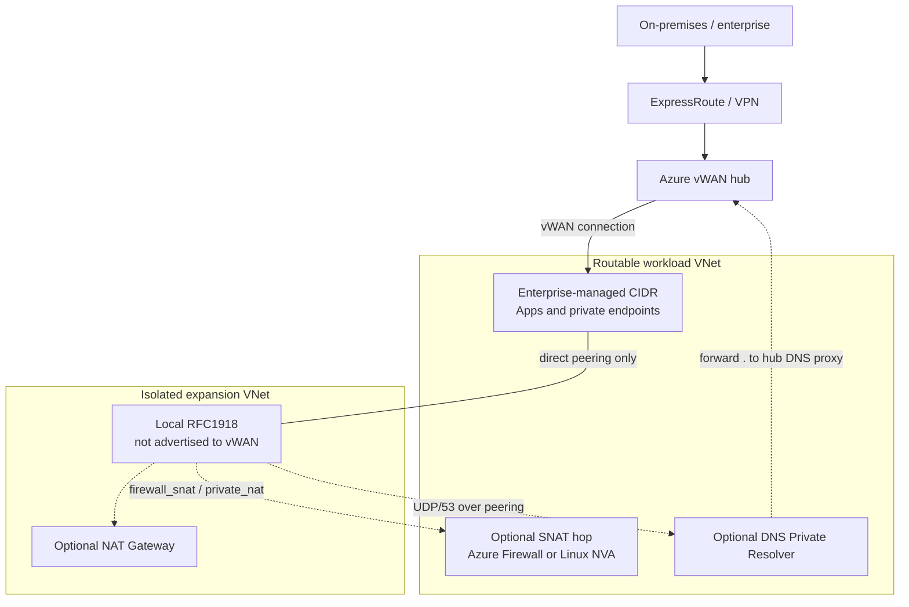

# isolated_expansion_vnet

Provide Azure workloads with additional private RFC1918 address space **without consuming centrally managed enterprise-routable address space**.

The expansion VNet:

- is not connected to Azure Virtual WAN
- is not propagated into enterprise routing
- is not advertised to ExpressRoute, VPN, or on-premises networks
- is directly peered to the workload landing zone's existing routable VNet
- can consume resources and private endpoints in that routable VNet
- can host workloads that need large private address ranges
- supports NAT Gateway egress, firewall-based private SNAT, or a spoke Linux NVA for private SNAT

The isolated CIDR is usable inside Azure but does not become part of the enterprise routing domain.

Typical consumers include large compute clusters, AKS and other container platforms, data and analytics platforms, CI/CD runners, AI/ML compute, batch processing, and VNet-injected managed services.

This module owns the network pattern only. Workload-specific networking (AKS, Databricks, runners, and similar) belongs in wrapper modules.

## Architecture



The expansion VNet peers only to the routable workload VNet. Its prefix is never advertised into vWAN, ExpressRoute, or on-prem. `firewall_snat` and `private_nat` create the SNAT hop in the **routable** VNet so enterprise destinations see a spoke IP. `nat` attaches a NAT Gateway in the expansion VNet. Default `none` is the diagram without those hops: local VNet, peering, and private endpoints only.

`none` and `nat` cannot reach the central DNS resolver inbound, so private DNS needs either `spoke_dns_resolver` in the routable VNet (shown) or a `dns_forwarding_ruleset_id` link that keeps Azure-provided DNS. Those two options are mutually exclusive. `firewall_snat` and `private_nat` can reach enterprise DNS after SNAT.

## Addressing

The existing workload VNet keeps its centrally allocated enterprise-routable prefix. The expansion VNet uses a separate RFC1918 pool reserved for isolated / local Azure use. The module default is `10.10.0.0/16`.

Example:

```text
Routable workload VNet    10.40.32.0/21
Expansion VNet            10.10.0.0/16
```

The expansion range must not overlap the routable VNet, another directly peered VNet, or destinations the expansion workload must reach without SNAT. It must not be propagated to vWAN or advertised over ExpressRoute or VPN.

The same isolated prefix may be reused elsewhere only when those networks can never become directly connected or mutually routable. That reuse policy belongs in platform IPAM, not in this module.

## Egress modes

`none` is the default. Use it when the workload must stay on private paths only: the expansion VNet itself, the directly peered routable VNet, and Private Endpoints reachable over that peering or in the expansion VNet. The module does not create a NAT Gateway and installs a `0.0.0.0/0 -> None` blackhole plus an Internet-deny NSG rule. If residual Databricks-owned endpoints still need a public or enterprise path, use `firewall_snat` instead of claiming a no-egress VNet.

`nat` is for workloads that only need resources in the directly peered workload VNet, private endpoints in that VNet, and public outbound connectivity.

`firewall_snat` is the same translation contract as `private_nat`, implemented with a forced-tunnel Azure Firewall in the routable spoke. The module creates `AzureFirewallSubnet` and `AzureFirewallManagementSubnet`, SNATs isolated sources to the firewall's spoke IP, then follows the spoke's existing hub/vWAN path. The isolated prefix still must not appear in enterprise routing.

`private_nat` is the same contract with a Linux NVA (IP forwarding plus iptables MASQUERADE) instead of Azure Firewall. Use it when you want a cheaper single-VM hop rather than a managed firewall.

Do not attach the expansion VNet to vWAN and rely on a central hub firewall. That would require vWAN to learn the isolated prefix.

### NAT mode traffic

| Flow | Result |
| --- | --- |
| Expansion → routable VNet / private endpoints | Direct peering, original source IP, no NAT |
| Expansion → Internet | NAT Gateway public IP |
| Expansion → other vWAN spokes or on-prem | Not supported |
| On-prem → expansion | Not supported |

NAT mode does not create a `0.0.0.0/0` virtual appliance route. Internet egress is provided by subnet NAT Gateway association.

### Firewall SNAT mode traffic

| Flow | Result |
| --- | --- |
| Expansion → routable VNet (default `direct_peer_bypass = true`) | Direct peering, original source IP |
| Expansion → any other destination (`route_internet_through_firewall = true`) | `0.0.0.0/0` to the firewall; destination sees the firewall IP |
| Enterprise / on-prem → expansion CIDR | Not required and must not be configured |

The module creates the spoke firewall, a dedicated firewall policy that allows expansion sources to any destination, and forced-tunnel SNAT so RFC1918 destinations are translated. Pass two unused `/26` or larger prefixes already in the spoke address space. Associate `spoke_route_table_id` on `AzureFirewallSubnet` when SNATed packets should follow an existing spoke UDR (for example `0.0.0.0/0` to the hub firewall). Do not put that table on `AzureFirewallManagementSubnet`, and do not put a route for the isolated prefix on it.

Azure forbids NSGs on `AzureFirewallSubnet` and `AzureFirewallManagementSubnet`. Landing-zone policy may also need an exemption to create Azure Firewall in an application subscription. One Azure Firewall per spoke VNet: those subnet names are reserved.

Setting `direct_peer_bypass = false` steers even the routable VNet CIDR through the firewall so the expansion prefix can be hidden from the peer. That is supported but is not the default.

### Private NAT mode traffic

| Flow | Result |
| --- | --- |
| Expansion → routable VNet (default `direct_peer_bypass = true`) | Direct peering, original source IP |
| Expansion → any other destination (`route_internet_through_nva = true`) | `0.0.0.0/0` to the spoke NVA; destination sees the NVA IP |
| Enterprise / on-prem → expansion CIDR | Not required and must not be configured |

The module creates the NVA, its spoke subnet and NSG, IP forwarding, SNAT rules, expansion UDRs, and forwarded-traffic peering. Pass an unused `/28` or larger prefix already in the spoke address space and an SSH public key. Associate `spoke_route_table_id` when the NVA should follow an existing spoke UDR (for example `0.0.0.0/0` to the hub firewall) after SNAT. Do not put a route for the isolated prefix on that table.

The NVA has no public IP. SSH is allowed from the spoke address space (and optional `ssh_source_prefixes`). This is a single VM with no HA; treat it as a landing-zone hop, not a high-throughput firewall. ACI cannot be this hop: it has no IP forwarding and cannot be a UDR next hop.

Setting `direct_peer_bypass = false` steers even the routable VNet CIDR through the NVA. That is supported but is not the default.

### None mode traffic

| Flow | Result |
| --- | --- |
| Expansion → routable VNet / customer Private Endpoints | Direct peering, original source IP |
| Expansion → local Private Endpoints (for example `databricks_ui_api`) | VNet local |
| Expansion → Internet | Dropped |
| Expansion → other vWAN spokes or on-prem | Not supported |
| On-prem → expansion | Not supported |

None mode is the intended Databricks classic compute-plane pattern when customer Storage, Key Vault, Event Hubs, and similar Private Endpoints live in the routable VNet, and the Databricks control-plane PE lives in a dedicated subnet in the expansion VNet. Databricks-owned artifact storage, log storage, platform Event Hubs, and metastore endpoints are not necessarily resources you can attach your own Private Endpoints to. Validate those residual dependencies before treating Internet egress as unnecessary.

## Decision rule

```text
Need only local VNet, direct peering, and Private Endpoints,
with Internet explicitly blocked?
  → egress.mode = "none"   (default)

Need public egress as well, but only to the peered VNet
and its private endpoints?
  → egress.mode = "nat"

Need on-prem, other spokes, or residual platform endpoints
without advertising the isolated CIDR, with this module
creating a forced-tunnel Azure Firewall in the spoke?
  → egress.mode = "firewall_snat"

Need the same translated enterprise path, with this module
creating a Linux NVA in the routable spoke?
  → egress.mode = "private_nat"
```

Changing `egress.mode` destroys and creates the mode-specific hops: NAT Gateway, spoke Azure Firewall, or spoke NVA. `none`, `private_nat`, and `firewall_snat` keep the same expansion route table (`${name}-none`) and update the default `0.0.0.0/0` next hop and enterprise UDRs in place, so Azure is not asked to delete a table that caller-managed subnets still reference. Associate those subnets from `egress_route_table_id`.

## Usage

### NAT Gateway

```hcl
module "compute_expansion" {
  source = "../../isolated_expansion_vnet"

  name                = "compute-isolated-expansion"
  location            = "canadacentral"
  resource_group_name = "<resource-group-name>"

  address_space = ["10.10.0.0/16"]

  routable_vnet = {
    id                  = module.workload_vnet.resource_id
    name                = module.workload_vnet.name
    resource_group_name = module.workload_vnet.resource_group_name
    address_space       = module.workload_vnet.address_space
  }

  subnets = {
    compute = {
      address_prefix = "10.10.0.0/20"
    }

    workers = {
      address_prefix = "10.10.16.0/20"
    }
  }

  egress = {
    mode = "nat"

    nat = {
      public_ip_count = 1
    }
  }

  dns_forwarding_ruleset_id = var.isolated_expansion_dns_forwarding_ruleset_id
}
```

### Firewall SNAT

```hcl
module "compute_expansion" {
  source = "../../isolated_expansion_vnet"

  name                = "compute-isolated-expansion"
  location            = "canadacentral"
  resource_group_name = "<resource-group-name>"

  address_space = ["10.10.0.0/16"]

  routable_vnet = {
    id                  = module.workload_vnet.resource_id
    name                = module.workload_vnet.name
    resource_group_name = module.workload_vnet.resource_group_name
    address_space       = module.workload_vnet.address_space
  }

  subnets = {
    compute = {
      address_prefix = "10.10.0.0/20"
    }
  }

  egress = {
    mode = "firewall_snat"

    firewall = {
      subnet_address_prefix            = "10.40.32.64/26"
      management_subnet_address_prefix = "10.40.32.128/26"
      spoke_route_table_id             = var.spoke_route_table_id
    }
  }

  dns_forwarding_ruleset_id = var.isolated_expansion_dns_forwarding_ruleset_id
}
```

### Private NAT

```hcl
module "compute_expansion" {
  source = "../../isolated_expansion_vnet"

  name                = "compute-isolated-expansion"
  location            = "canadacentral"
  resource_group_name = "<resource-group-name>"

  address_space = ["10.10.0.0/16"]

  routable_vnet = {
    id                  = module.workload_vnet.resource_id
    name                = module.workload_vnet.name
    resource_group_name = module.workload_vnet.resource_group_name
    address_space       = module.workload_vnet.address_space
  }

  subnets = {
    compute = {
      address_prefix = "10.10.0.0/20"
    }
  }

  egress = {
    mode = "private_nat"

    private_nat = {
      subnet_address_prefix = "10.40.32.64/28"
      ssh_public_key        = file("~/.ssh/id_rsa.pub")
    }
  }
}
```

Default egress is `0.0.0.0/0` through the NVA. Spoke prefixes stay on peering (longer match). `subnet_address_prefix` must be unused space already in the spoke. The module places the NVA at `.4` in that prefix unless you set `private_ip`.

### No Internet egress

```hcl
module "databricks_expansion" {
  source = "../../isolated_expansion_vnet"

  name                = "databricks-isolated-expansion"
  location            = "canadacentral"
  resource_group_name = "<resource-group-name>"

  routable_vnet = {
    id                  = module.workload_vnet.resource_id
    name                = module.workload_vnet.name
    resource_group_name = module.workload_vnet.resource_group_name
    address_space       = module.workload_vnet.address_space
  }

  subnets = {
    databricks_public = {
      address_prefix = "10.10.0.0/22"

      delegation = {
        service_name = "Microsoft.Databricks/workspaces"
        actions = [
          "Microsoft.Network/virtualNetworks/subnets/join/action",
          "Microsoft.Network/virtualNetworks/subnets/prepareNetworkPolicies/action",
          "Microsoft.Network/virtualNetworks/subnets/unprepareNetworkPolicies/action"
        ]
      }
    }

    databricks_private = {
      address_prefix = "10.10.4.0/22"

      delegation = {
        service_name = "Microsoft.Databricks/workspaces"
        actions = [
          "Microsoft.Network/virtualNetworks/subnets/join/action",
          "Microsoft.Network/virtualNetworks/subnets/prepareNetworkPolicies/action",
          "Microsoft.Network/virtualNetworks/subnets/unprepareNetworkPolicies/action"
        ]
      }
    }

    private_endpoints = {
      address_prefix = "10.10.8.0/26"
    }
  }

  egress = {
    mode = "none"
  }

  spoke_dns_resolver = {
    enabled                 = true
    inbound_address_prefix  = "10.40.32.0/28"
    outbound_address_prefix = "10.40.32.16/28"
    forward_to              = ["<hub-firewall-dns-proxy-ip>"]
  }
}
```

Place customer Storage, Key Vault, SQL, and application Private Endpoints in the routable workload VNet. Place the Databricks `databricks_ui_api` Private Endpoint in the expansion VNet `private_endpoints` subnet. This module does not create those endpoints.

## What this module does not own

- the existing routable workload VNet
- vWAN, ExpressRoute, or VPN
- central DNS zone resources
- the platform forwarding ruleset used by `dns_forwarding_ruleset_id`
- private endpoints (prefer placing them in the routable VNet)
- workloads deployed into the expansion VNet
- the hub firewall or shared enterprise firewall policy (`firewall_snat` creates a spoke Azure Firewall instead; `private_nat` creates a spoke NVA)

Private endpoints may be created in the expansion VNet, but those isolated addresses (for example `10.10.x.x`) are reachable only from networks that know the isolated prefix: the expansion VNet itself and the directly peered routable VNet.

## NSGs and security

Each subnet gets an NSG unless you pass an existing `nsg_id`. Baseline rules allow Azure Load Balancer inbound and VNet outbound, and deny Internet inbound. NAT allows Internet outbound. firewall_snat and private_nat (when `0.0.0.0/0` is routed through the hop) allow all outbound destinations; the Azure `Internet` tag does not include RFC1918. `none` denies Internet outbound. `enterprise_routes` is only for extra prefixes when that default route is disabled. The private_nat NVA subnet NSG allows forwarded traffic from the expansion CIDR and SSH from the spoke. Azure Firewall subnets (`AzureFirewallSubnet` and `AzureFirewallManagementSubnet`) cannot have NSGs.

Do not treat the expansion CIDR as trusted merely because it is peered. Scope access on the routable side (for example TCP 443 from a specific expansion subnet to a private endpoint subnet) instead of allowing `10.10.0.0/16` to any destination.

Wrapper modules should add AKS, Databricks, runner, or application rules through `nsg_rules` or per-subnet `nsg_rules`.

## Platform classification

Resources are tagged:

```text
network_classification = isolated_expansion
isolated_address_space = true
```

Landing zone policy distinguishes these VNets from enterprise-routed spokes:

| Classification | Address space | Connectivity |
| --- | --- | --- |
| `enterprise_routed` | Central IPAM CIDR | vWAN, enterprise routing, hybrid connectivity |
| `isolated_expansion` | Local RFC1918 CIDR | Direct peering only, explicit outbound, no gateway transit |

Name the VNet so it ends with `-isolated-expansion`. Do **not** use a `*-vwan-spoke` name. That pattern is reserved for enterprise-routed spokes and would invite vWAN automation.

Peering names are prefixed with `isolated-expansion-` so `Deny-New-VNet-Peerings` can allow this pattern without opening arbitrary peerings.

This module never offers `enable_vwan`. If a consumer needs a vWAN connection, they are no longer using this architecture.

## Connectivity matrix

| Capability | NAT | Firewall SNAT | Private NAT | None |
| --- | :---: | :---: | :---: | :---: |
| Large isolated CIDR | yes | yes | yes | yes |
| Direct peer access | yes | yes | yes | yes |
| Access workload private endpoints | yes | yes | yes | yes |
| Public Internet egress | yes | yes | optional | no |
| Private SNAT | no | yes | yes | no |
| Reach other vWAN spokes / on-prem | no | yes | yes | no |
| Enterprise route to isolated CIDR required | no | no | no | no |
| Expansion CIDR propagated into vWAN | no | no | no | no |

## Acceptance tests

NAT mode: expansion can reach the routable VNet, its private endpoints, and the Internet via the NAT public IP. Expansion cannot reach on-prem or other spokes. The isolated prefix must not appear in vWAN routing or ExpressRoute advertisements.

Firewall SNAT mode: local peer traffic keeps the original expansion source IP. Enterprise destinations see the spoke Azure Firewall private IP. Return traffic comes to that spoke IP and is un-SNATed back across peering. The isolated prefix still must not appear in enterprise routing, vWAN, or ExpressRoute.

Private NAT mode: local peer traffic keeps the original expansion source IP. Enterprise destinations see the spoke NVA private IP. Return traffic comes to that spoke IP and is un-SNATed back across peering. The isolated prefix still must not appear in enterprise routing, vWAN, or ExpressRoute.

None mode: expansion can reach the routable VNet, customer Private Endpoints over peering, and local Private Endpoints. Internet and other spokes fail. The isolated prefix must not appear in vWAN routing or ExpressRoute advertisements.

## Private DNS resolution

This module does not create private DNS zone virtual network links. Isolated expansion VNets are not vWAN spokes. They do not receive the hub firewall DNS servers and, in `none` mode, they cannot reach the central Private DNS Resolver inbound. Use one of the two resolver paths below.

### Spoke DNS resolver (recommended for `none` mode)

Set `spoke_dns_resolver.enabled = true` to create a DNS Private Resolver **in the routable spoke**. The expansion VNet uses that inbound IP as custom DNS. The resolver forwards all queries (`.`) to `forward_to`, which should be the hub firewall DNS proxy the spoke already uses. The firewall already forwards to the central inbound, whose VNet is linked to the privatelink zones. Do not point `forward_to` or `additional_forward_domains` at the central inbound; spokes are not allowed to query that inbound directly.

Pass `routable_vnet.address_space` so the inbound NSG allows DNS from the spoke as well as the expansion VNet. Use `additional_forward_domains` for suffixes such as `azuredatabricks.net` that should use an explicit rule to the same firewall DNS servers.

```text
Expansion  --UDP/53 over peering-->  spoke inbound
           --forward . ------------>  hub firewall DNS proxy
           ------------------------>  central resolver inbound
           ------------------------>  central private DNS zones
```

No private DNS zone links are created on the expansion VNet. Enable this on **at most one** expansion module per spoke (Azure allows one resolver per VNet).

`inbound_address_prefix` and `outbound_address_prefix` must be unused prefixes already in the spoke address space, `/28` or larger, and delegated exclusively to `Microsoft.Network/dnsResolvers`. Do not point `forward_to` at the central inbound unless firewall policy already allows spoke-to-inbound port 53.

```hcl
module "databricks_expansion" {
  source = "../../isolated_expansion_vnet"

  # ...

  egress = {
    mode = "none"
  }

  spoke_dns_resolver = {
    enabled                 = true
    inbound_address_prefix  = "10.40.32.0/28"
    outbound_address_prefix = "10.40.32.16/28"
    forward_to              = ["<hub-firewall-dns-proxy-ip>"]
    additional_forward_domains = [
      "azuredatabricks.net.",
      "privatelink.azuredatabricks.net.",
    ]
  }
}
```

Leave `dns.mode` as `azure` when the resolver is enabled. The module overwrites the expansion VNet DNS servers with the spoke inbound IP.

### Central ruleset link (Azure-provided DNS)

When the platform has published a **second** forwarding ruleset on the existing central resolver outbound, pass `dns_forwarding_ruleset_id`. The expansion VNet keeps Azure-provided DNS (`168.63.129.16`). The module only creates a ruleset virtual network link.

```hcl
spoke_dns_resolver = {
  enabled = false
}

dns_forwarding_ruleset_id = var.isolated_expansion_dns_forwarding_ruleset_id
```

Platform contract for that ruleset:

- It lives on the current central outbound endpoint, not a new resolver.
- It has one rule: `.` → central resolver inbound.
- It is linked only to `*-isolated-expansion` VNets.
- It must **never** be linked to the resolver VNet itself.
- Do **not** add a “forward to inbound” rule on the existing on-prem ruleset.

The VM never opens a socket to the central resolver inbound. Azure DNS plus the hub outbound perform the hop, so `none` mode still works. `spoke_dns_resolver` and `dns_forwarding_ruleset_id` are mutually exclusive.

`dns.mode = "custom"` remains available for an already-reachable resolver IP. If those servers live only in the enterprise, use `firewall_snat` or `private_nat`.

## Invariant

The expansion prefix may be known by the expansion VNet, its directly peered workload VNet, and an optional translation/security boundary. It must never become a required route in the enterprise routing domain.

<!-- BEGIN_TF_DOCS -->
## Requirements

| Name | Version |
|------|---------|
| <a name="requirement_terraform"></a> [terraform](#requirement\_terraform) | >=1.9.0, < 2.0.0 |
| <a name="requirement_azapi"></a> [azapi](#requirement\_azapi) | ~> 2.0 |
| <a name="requirement_azurerm"></a> [azurerm](#requirement\_azurerm) | ~> 4.0 |

## Providers

| Name | Version |
|------|---------|
| <a name="provider_azapi"></a> [azapi](#provider\_azapi) | ~> 2.0 |
| <a name="provider_azurerm"></a> [azurerm](#provider\_azurerm) | ~> 4.0 |

## Modules

No modules.

## Resources

| Name | Type |
|------|------|
| [azapi_resource.firewall_subnet](https://registry.terraform.io/providers/azure/azapi/latest/docs/resources/resource) | resource |
| [azapi_resource.private_nat_subnet](https://registry.terraform.io/providers/azure/azapi/latest/docs/resources/resource) | resource |
| [azapi_resource.spoke_dns_subnet](https://registry.terraform.io/providers/azure/azapi/latest/docs/resources/resource) | resource |
| [azurerm_firewall.spoke](https://registry.terraform.io/providers/hashicorp/azurerm/latest/docs/resources/firewall) | resource |
| [azurerm_firewall_policy.spoke](https://registry.terraform.io/providers/hashicorp/azurerm/latest/docs/resources/firewall_policy) | resource |
| [azurerm_firewall_policy_rule_collection_group.spoke](https://registry.terraform.io/providers/hashicorp/azurerm/latest/docs/resources/firewall_policy_rule_collection_group) | resource |
| [azurerm_linux_virtual_machine.private_nat](https://registry.terraform.io/providers/hashicorp/azurerm/latest/docs/resources/linux_virtual_machine) | resource |
| [azurerm_nat_gateway.this](https://registry.terraform.io/providers/hashicorp/azurerm/latest/docs/resources/nat_gateway) | resource |
| [azurerm_nat_gateway_public_ip_association.this](https://registry.terraform.io/providers/hashicorp/azurerm/latest/docs/resources/nat_gateway_public_ip_association) | resource |
| [azurerm_network_interface.private_nat](https://registry.terraform.io/providers/hashicorp/azurerm/latest/docs/resources/network_interface) | resource |
| [azurerm_network_security_group.private_nat](https://registry.terraform.io/providers/hashicorp/azurerm/latest/docs/resources/network_security_group) | resource |
| [azurerm_network_security_group.spoke_dns_inbound](https://registry.terraform.io/providers/hashicorp/azurerm/latest/docs/resources/network_security_group) | resource |
| [azurerm_network_security_group.spoke_dns_outbound](https://registry.terraform.io/providers/hashicorp/azurerm/latest/docs/resources/network_security_group) | resource |
| [azurerm_network_security_group.this](https://registry.terraform.io/providers/hashicorp/azurerm/latest/docs/resources/network_security_group) | resource |
| [azurerm_network_security_rule.private_nat](https://registry.terraform.io/providers/hashicorp/azurerm/latest/docs/resources/network_security_rule) | resource |
| [azurerm_network_security_rule.spoke_dns_inbound](https://registry.terraform.io/providers/hashicorp/azurerm/latest/docs/resources/network_security_rule) | resource |
| [azurerm_network_security_rule.spoke_dns_outbound](https://registry.terraform.io/providers/hashicorp/azurerm/latest/docs/resources/network_security_rule) | resource |
| [azurerm_network_security_rule.this](https://registry.terraform.io/providers/hashicorp/azurerm/latest/docs/resources/network_security_rule) | resource |
| [azurerm_private_dns_resolver.spoke](https://registry.terraform.io/providers/hashicorp/azurerm/latest/docs/resources/private_dns_resolver) | resource |
| [azurerm_private_dns_resolver_dns_forwarding_ruleset.spoke](https://registry.terraform.io/providers/hashicorp/azurerm/latest/docs/resources/private_dns_resolver_dns_forwarding_ruleset) | resource |
| [azurerm_private_dns_resolver_forwarding_rule.spoke_additional](https://registry.terraform.io/providers/hashicorp/azurerm/latest/docs/resources/private_dns_resolver_forwarding_rule) | resource |
| [azurerm_private_dns_resolver_forwarding_rule.spoke_all](https://registry.terraform.io/providers/hashicorp/azurerm/latest/docs/resources/private_dns_resolver_forwarding_rule) | resource |
| [azurerm_private_dns_resolver_inbound_endpoint.spoke](https://registry.terraform.io/providers/hashicorp/azurerm/latest/docs/resources/private_dns_resolver_inbound_endpoint) | resource |
| [azurerm_private_dns_resolver_outbound_endpoint.spoke](https://registry.terraform.io/providers/hashicorp/azurerm/latest/docs/resources/private_dns_resolver_outbound_endpoint) | resource |
| [azurerm_private_dns_resolver_virtual_network_link.expansion](https://registry.terraform.io/providers/hashicorp/azurerm/latest/docs/resources/private_dns_resolver_virtual_network_link) | resource |
| [azurerm_private_dns_resolver_virtual_network_link.spoke](https://registry.terraform.io/providers/hashicorp/azurerm/latest/docs/resources/private_dns_resolver_virtual_network_link) | resource |
| [azurerm_public_ip.firewall_data](https://registry.terraform.io/providers/hashicorp/azurerm/latest/docs/resources/public_ip) | resource |
| [azurerm_public_ip.firewall_management](https://registry.terraform.io/providers/hashicorp/azurerm/latest/docs/resources/public_ip) | resource |
| [azurerm_public_ip.nat](https://registry.terraform.io/providers/hashicorp/azurerm/latest/docs/resources/public_ip) | resource |
| [azurerm_route.default_internet](https://registry.terraform.io/providers/hashicorp/azurerm/latest/docs/resources/route) | resource |
| [azurerm_route.firewall](https://registry.terraform.io/providers/hashicorp/azurerm/latest/docs/resources/route) | resource |
| [azurerm_route.private_nat](https://registry.terraform.io/providers/hashicorp/azurerm/latest/docs/resources/route) | resource |
| [azurerm_route_table.expansion](https://registry.terraform.io/providers/hashicorp/azurerm/latest/docs/resources/route_table) | resource |
| [azurerm_subnet_nat_gateway_association.this](https://registry.terraform.io/providers/hashicorp/azurerm/latest/docs/resources/subnet_nat_gateway_association) | resource |
| [azurerm_subnet_route_table_association.this](https://registry.terraform.io/providers/hashicorp/azurerm/latest/docs/resources/subnet_route_table_association) | resource |
| [azurerm_virtual_network.this](https://registry.terraform.io/providers/hashicorp/azurerm/latest/docs/resources/virtual_network) | resource |
| [azurerm_virtual_network_peering.expansion_to_routable](https://registry.terraform.io/providers/hashicorp/azurerm/latest/docs/resources/virtual_network_peering) | resource |
| [azurerm_virtual_network_peering.routable_to_expansion](https://registry.terraform.io/providers/hashicorp/azurerm/latest/docs/resources/virtual_network_peering) | resource |

## Inputs

| Name | Description | Type | Default | Required |
|------|-------------|------|---------|:--------:|
| <a name="input_address_space"></a> [address\_space](#input\_address\_space) | Isolated RFC1918 address space for the expansion VNet. Must not overlap the routable workload VNet, other directly peered networks, or destinations the expansion workload must reach without SNAT. This prefix must never be advertised into the enterprise routing domain. Defaults to 10.10.0.0/16. | `list(string)` | <pre>[<br/>  "10.10.0.0/16"<br/>]</pre> | no |
| <a name="input_disallowed_address_spaces"></a> [disallowed\_address\_spaces](#input\_disallowed\_address\_spaces) | Known directly connected or otherwise incompatible CIDRs. The module fails if the expansion address space overlaps any of these prefixes. Full enterprise IPAM validation remains outside Terraform. | `list(string)` | `[]` | no |
| <a name="input_dns"></a> [dns](#input\_dns) | DNS configuration for the expansion VNet. Azure-provided DNS is the default. Use custom servers only when those resolvers are reachable from the expansion VNet (in the directly peered workload VNet for NAT mode, or via firewall SNAT for enterprise DNS). When spoke\_dns\_resolver.enabled is true, leave this at the default; the module points the expansion VNet at the spoke inbound endpoint. | <pre>object({<br/>    mode    = optional(string, "azure")<br/>    servers = optional(list(string), [])<br/>  })</pre> | <pre>{<br/>  "mode": "azure"<br/>}</pre> | no |
| <a name="input_dns_forwarding_ruleset_id"></a> [dns\_forwarding\_ruleset\_id](#input\_dns\_forwarding\_ruleset\_id) | Optional existing central DNS forwarding ruleset ID to link to the expansion VNet (Azure-provided DNS / slimmer platform variant). The ruleset must forward queries to a resolver inbound whose VNet is linked to the central private zones, and must not itself be linked to that inbound VNet. Mutually exclusive with spoke\_dns\_resolver.enabled. | `string` | `null` | no |
| <a name="input_egress"></a> [egress](#input\_egress) | Outbound connectivity model. Defaults to `none` (private paths only: local VNet, direct peering, and Private Endpoints, with no NAT Gateway or Internet route). Use `nat` when the workload also needs public egress. Use `firewall_snat` to create a forced-tunnel Azure Firewall in the routable spoke that SNATs isolated sources to the firewall's spoke IP. Use `private_nat` to create a Linux NVA in the spoke for the same translation contract. | <pre>object({<br/>    mode = optional(string, "none")<br/>    nat = optional(object({<br/>      public_ip_count = optional(number, 1)<br/>      idle_timeout    = optional(number, 10)<br/>      zones           = optional(list(string), ["1"])<br/>      sku_name        = optional(string, "Standard")<br/>      }), {<br/>      public_ip_count = 1<br/>      idle_timeout    = 10<br/>      zones           = ["1"]<br/>      sku_name        = "Standard"<br/>    })<br/>    firewall = optional(object({<br/>      subnet_address_prefix            = string<br/>      management_subnet_address_prefix = string<br/>      private_ip                       = optional(string)<br/>      sku_tier                         = optional(string, "Standard")<br/>      spoke_route_table_id             = optional(string)<br/>      direct_peer_bypass               = optional(bool, true)<br/>      route_internet_through_firewall  = optional(bool, true)<br/>      zones                            = optional(list(string))<br/>    }))<br/>    private_nat = optional(object({<br/>      subnet_address_prefix      = string<br/>      ssh_public_key             = string<br/>      subnet_name                = optional(string)<br/>      private_ip                 = optional(string)<br/>      vm_size                    = optional(string, "Standard_B2s")<br/>      admin_username             = optional(string, "azureadmin")<br/>      os_disk_size_gb            = optional(number, 30)<br/>      zone                       = optional(string)<br/>      spoke_route_table_id       = optional(string)<br/>      ssh_source_prefixes        = optional(list(string), [])<br/>      direct_peer_bypass         = optional(bool, true)<br/>      route_internet_through_nva = optional(bool, true)<br/>      image = optional(object({<br/>        publisher = optional(string, "Canonical")<br/>        offer     = optional(string, "ubuntu-26_04-lts")<br/>        sku       = optional(string, "server-gen1")<br/>        version   = optional(string, "latest")<br/>      }), {})<br/>    }))<br/>  })</pre> | <pre>{<br/>  "mode": "none"<br/>}</pre> | no |
| <a name="input_enterprise_routes"></a> [enterprise\_routes](#input\_enterprise\_routes) | Optional extra prefixes to steer to the SNAT hop. The default egress path is 0.0.0.0/0 (route\_internet\_through\_nva / route\_internet\_through\_firewall). Use this only when that default is disabled and specific prefixes still need translation. Do not list 10.0.0.0/8, 142.0.0.0/8, or other stand-ins for default egress. | `list(string)` | `[]` | no |
| <a name="input_location"></a> [location](#input\_location) | (Required) Azure region to deploy to. Changing this forces a new resource to be created. | `string` | n/a | yes |
| <a name="input_name"></a> [name](#input\_name) | Logical name for the isolated expansion VNet. Used as the Virtual Network name unless virtual\_network\_name is set. In this landing zone, the VNet name should end with `-isolated-expansion` so platform policy can distinguish it from enterprise-routed spokes. | `string` | n/a | yes |
| <a name="input_nsg_default_rules_enabled"></a> [nsg\_default\_rules\_enabled](#input\_nsg\_default\_rules\_enabled) | Create the module's baseline NSG rules (Azure Load Balancer inbound, VNet outbound, deny Internet inbound, default egress in nat/firewall\_snat/private\_nat when 0.0.0.0/0 is routed, Internet deny in none, and optional enterprise-route outbound). Disable only when supplying a complete custom rule set. | `bool` | `true` | no |
| <a name="input_nsg_rules"></a> [nsg\_rules](#input\_nsg\_rules) | Additional NSG rules applied to every subnet NSG created by this module. Use subnet-level nsg\_rules for workload-specific exceptions. Do not add allow-all rules from the expansion CIDR. | <pre>map(object({<br/>    priority                     = number<br/>    direction                    = string<br/>    access                       = string<br/>    protocol                     = string<br/>    description                  = optional(string)<br/>    source_port_range            = optional(string)<br/>    source_port_ranges           = optional(list(string))<br/>    destination_port_range       = optional(string)<br/>    destination_port_ranges      = optional(list(string))<br/>    source_address_prefix        = optional(string)<br/>    source_address_prefixes      = optional(list(string))<br/>    destination_address_prefix   = optional(string)<br/>    destination_address_prefixes = optional(list(string))<br/>  }))</pre> | `{}` | no |
| <a name="input_resource_group_name"></a> [resource\_group\_name](#input\_resource\_group\_name) | (Required) Name of the existing resource group that will contain the expansion VNet and its supporting resources. | `string` | n/a | yes |
| <a name="input_routable_vnet"></a> [routable\_vnet](#input\_routable\_vnet) | The existing enterprise-routed workload VNet that this expansion VNet will be directly peered to. This is the only intended private path out of the isolated address space besides an optional spoke firewall or private-NAT SNAT hop. address\_space is required for firewall\_snat and private\_nat so those spoke subnets can be validated against the spoke. | <pre>object({<br/>    id                  = string<br/>    name                = string<br/>    resource_group_name = string<br/>    address_space       = optional(list(string), [])<br/>  })</pre> | n/a | yes |
| <a name="input_spoke_dns_resolver"></a> [spoke\_dns\_resolver](#input\_spoke\_dns\_resolver) | Optional DNS Private Resolver in the routable spoke. When enabled, the expansion VNet uses the spoke inbound endpoint as custom DNS and the resolver forwards all queries to forward\_to (typically the hub firewall DNS proxy). additional\_forward\_domains creates more-specific rules to the same forward\_to servers; use it for names such as azuredatabricks.net that must stay on the already-allowed firewall DNS path. Pass routable\_vnet.address\_space so the inbound NSG allows spoke clients as well as the expansion VNet. Private DNS zone links on the expansion VNet are not required. Enable on at most one expansion module per spoke. inbound\_address\_prefix and outbound\_address\_prefix must be unused /28 or larger prefixes already in the spoke address space. | <pre>object({<br/>    enabled                    = optional(bool, false)<br/>    inbound_address_prefix     = optional(string)<br/>    outbound_address_prefix    = optional(string)<br/>    inbound_ip                 = optional(string)<br/>    forward_to                 = optional(list(string), [])<br/>    additional_forward_domains = optional(list(string), [])<br/>  })</pre> | <pre>{<br/>  "enabled": false<br/>}</pre> | no |
| <a name="input_subnets"></a> [subnets](#input\_subnets) | Optional subnet map for the expansion VNet. Leave empty when the caller creates workload subnets separately. Wrapper modules should add service-specific delegation, endpoints, and NSG rules here rather than changing the core pattern. associate\_route\_table attaches the active egress route table through a dedicated association resource. | <pre>map(object({<br/>    address_prefix                                = string<br/>    name                                          = optional(string)<br/>    nsg_name                                      = optional(string)<br/>    create_nsg                                    = optional(bool, true)<br/>    nsg_id                                        = optional(string)<br/>    service_endpoints                             = optional(list(string), [])<br/>    private_endpoint_network_policies             = optional(string, "Enabled")<br/>    private_link_service_network_policies_enabled = optional(bool, true)<br/>    default_outbound_access_enabled               = optional(bool, false)<br/>    associate_nat_gateway                         = optional(bool, true)<br/>    associate_route_table                         = optional(bool, true)<br/>    delegation = optional(object({<br/>      name         = optional(string)<br/>      service_name = string<br/>      actions      = optional(list(string), ["Microsoft.Network/virtualNetworks/subnets/join/action"])<br/>    }))<br/>    nsg_rules = optional(map(object({<br/>      priority                     = number<br/>      direction                    = string<br/>      access                       = string<br/>      protocol                     = string<br/>      description                  = optional(string)<br/>      source_port_range            = optional(string)<br/>      source_port_ranges           = optional(list(string))<br/>      destination_port_range       = optional(string)<br/>      destination_port_ranges      = optional(list(string))<br/>      source_address_prefix        = optional(string)<br/>      source_address_prefixes      = optional(list(string))<br/>      destination_address_prefix   = optional(string)<br/>      destination_address_prefixes = optional(list(string))<br/>    })), {})<br/>  }))</pre> | `{}` | no |
| <a name="input_tags"></a> [tags](#input\_tags) | (Optional) Additional tags to merge with the isolated\_expansion classification tags. | `map(string)` | `{}` | no |
| <a name="input_virtual_network_name"></a> [virtual\_network\_name](#input\_virtual\_network\_name) | Override the Azure Virtual Network name. Defaults to `name`. Prefer a name ending in `-isolated-expansion`. | `string` | `null` | no |

## Outputs

| Name | Description |
|------|-------------|
| <a name="output_address_space"></a> [address\_space](#output\_address\_space) | Address space assigned to the isolated expansion Virtual Network. |
| <a name="output_dns_forwarding_ruleset_link_id"></a> [dns\_forwarding\_ruleset\_link\_id](#output\_dns\_forwarding\_ruleset\_link\_id) | Resource ID of the expansion VNet link to dns\_forwarding\_ruleset\_id when that input is set; otherwise null. |
| <a name="output_egress_mode"></a> [egress\_mode](#output\_egress\_mode) | Configured egress mode: nat, firewall\_snat, private\_nat, or none. |
| <a name="output_egress_route_table_id"></a> [egress\_route\_table\_id](#output\_egress\_route\_table\_id) | Route table ID for the active egress mode. Null in NAT mode. none, private\_nat, and firewall\_snat share one table so a mode change updates routes in place instead of deleting an in-use table. Callers that create their own subnets should associate this ID. |
| <a name="output_firewall_id"></a> [firewall\_id](#output\_firewall\_id) | Resource ID of the spoke Azure Firewall when egress.mode is firewall\_snat; otherwise null. |
| <a name="output_firewall_policy_id"></a> [firewall\_policy\_id](#output\_firewall\_policy\_id) | Resource ID of the spoke Azure Firewall policy when egress.mode is firewall\_snat; otherwise null. |
| <a name="output_firewall_private_ip"></a> [firewall\_private\_ip](#output\_firewall\_private\_ip) | Spoke Azure Firewall private IP used as the SNAT/routing boundary when egress.mode is firewall\_snat; otherwise null. |
| <a name="output_nat_gateway_id"></a> [nat\_gateway\_id](#output\_nat\_gateway\_id) | NAT Gateway resource ID when egress.mode is nat; otherwise null. |
| <a name="output_nat_public_ips"></a> [nat\_public\_ips](#output\_nat\_public\_ips) | Public IP addresses used by the NAT Gateway when egress.mode is nat; otherwise null. |
| <a name="output_network_classification"></a> [network\_classification](#output\_network\_classification) | Platform classification for this VNet. Isolated expansion VNets must not receive enterprise-routed spoke automation such as vWAN connections. |
| <a name="output_nsg_ids"></a> [nsg\_ids](#output\_nsg\_ids) | Map of subnet keys to NSG resource IDs created by this module. |
| <a name="output_peering_ids"></a> [peering\_ids](#output\_peering\_ids) | Resource IDs for both sides of the expansion-to-routable peering. |
| <a name="output_private_nat_private_ip"></a> [private\_nat\_private\_ip](#output\_private\_nat\_private\_ip) | Spoke NVA private IP used as the SNAT/routing boundary when egress.mode is private\_nat; otherwise null. |
| <a name="output_private_nat_subnet_id"></a> [private\_nat\_subnet\_id](#output\_private\_nat\_subnet\_id) | Resource ID of the spoke NVA subnet when egress.mode is private\_nat; otherwise null. |
| <a name="output_private_nat_vm_id"></a> [private\_nat\_vm\_id](#output\_private\_nat\_vm\_id) | Resource ID of the private NAT NVA when egress.mode is private\_nat; otherwise null. |
| <a name="output_required_firewall_routes"></a> [required\_firewall\_routes](#output\_required\_firewall\_routes) | Unused. firewall\_snat now creates the spoke firewall and its policy in this module. Always null. |
| <a name="output_required_firewall_rules"></a> [required\_firewall\_rules](#output\_required\_firewall\_rules) | Unused. firewall\_snat now creates the spoke firewall and its policy in this module. Always null. |
| <a name="output_required_private_snat"></a> [required\_private\_snat](#output\_required\_private\_snat) | Private SNAT contract: isolated source prefixes that must be translated to a spoke IP (Azure Firewall or NVA) before entering the enterprise routing domain. Null unless egress.mode is firewall\_snat or private\_nat. |
| <a name="output_route_table_ids"></a> [route\_table\_ids](#output\_route\_table\_ids) | Map of the active egress mode name to its route table ID. Empty in NAT mode. none, private\_nat, and firewall\_snat resolve to the same table. Prefer egress\_route\_table\_id when associating caller-managed subnets. |
| <a name="output_spoke_dns_resolver_id"></a> [spoke\_dns\_resolver\_id](#output\_spoke\_dns\_resolver\_id) | Resource ID of the spoke DNS Private Resolver when spoke\_dns\_resolver is enabled; otherwise null. |
| <a name="output_spoke_dns_resolver_inbound_ip"></a> [spoke\_dns\_resolver\_inbound\_ip](#output\_spoke\_dns\_resolver\_inbound\_ip) | Private IP of the spoke DNS resolver inbound endpoint when spoke\_dns\_resolver is enabled; otherwise null. The expansion VNet uses this as its custom DNS server. |
| <a name="output_subnet_ids"></a> [subnet\_ids](#output\_subnet\_ids) | Map of subnet keys to subnet resource IDs. |
| <a name="output_subnet_prefixes"></a> [subnet\_prefixes](#output\_subnet\_prefixes) | Map of subnet keys to subnet address prefixes. |
| <a name="output_vnet_id"></a> [vnet\_id](#output\_vnet\_id) | Resource ID of the isolated expansion Virtual Network. |
| <a name="output_vnet_name"></a> [vnet\_name](#output\_vnet\_name) | Name of the isolated expansion Virtual Network. |
<!-- END_TF_DOCS -->
