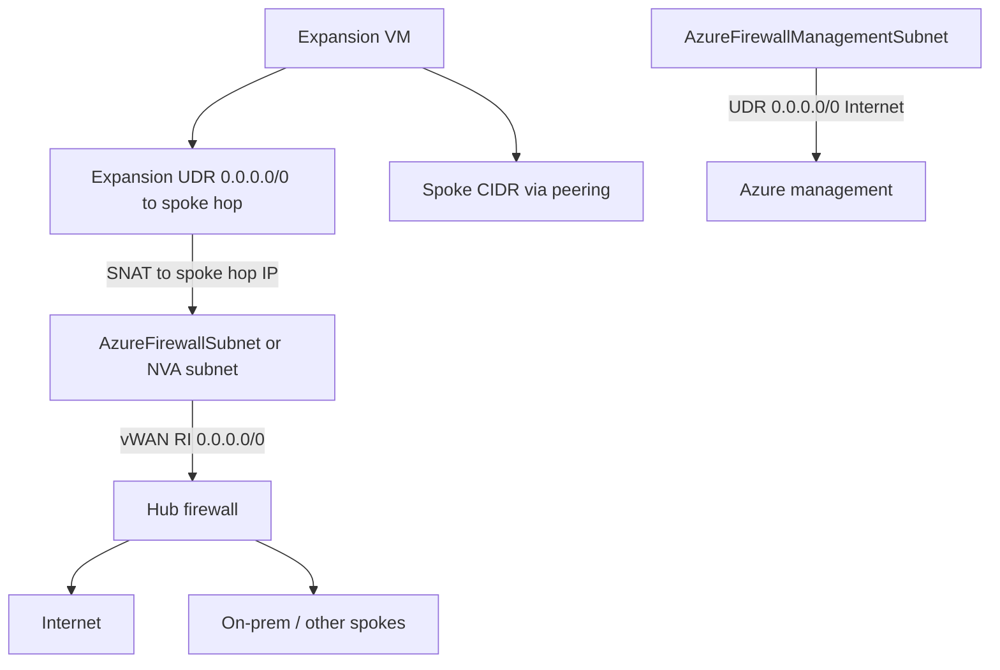
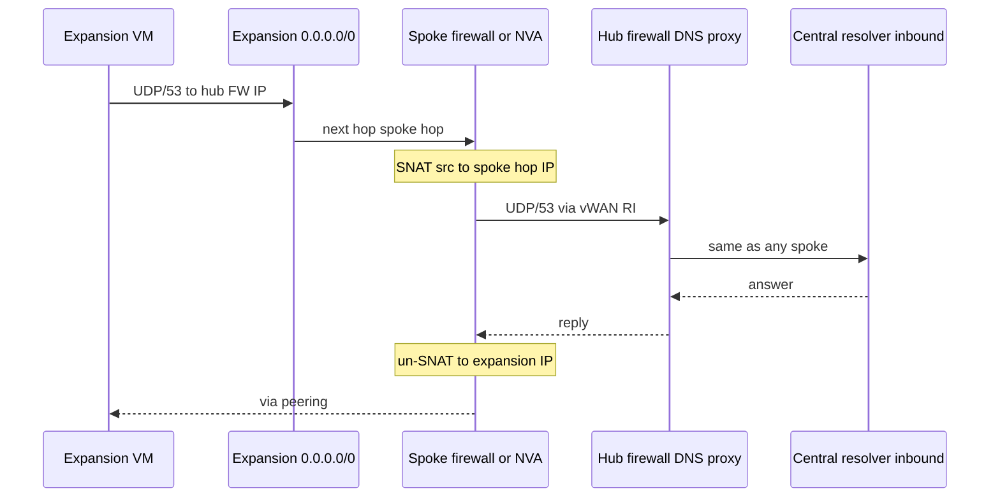
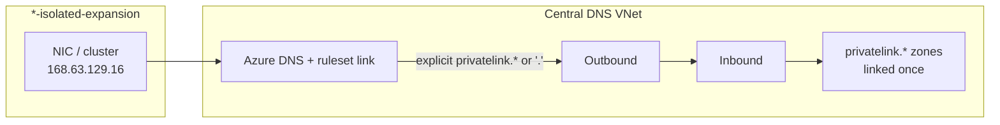
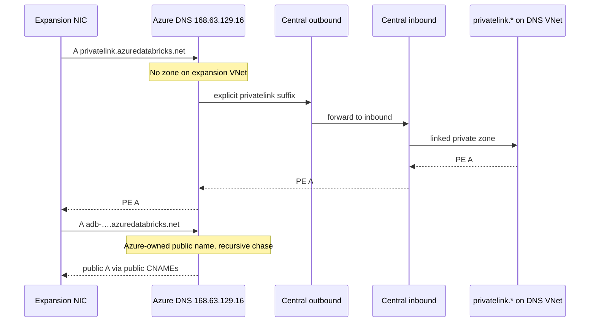

# Routing and DNS for isolated expansion VNets

This is the packet-level path for SNAT modes and the name-resolution path for every egress mode. The [README](README.md) keeps the short mode tables; use this file for how traffic and DNS actually move.

`firewall_snat` and `private_nat` share the same SNAT contract (spoke Azure Firewall vs Linux NVA). `none` and `nat` have no hub path, so they resolve private names with Azure-provided DNS plus the central isolated-expansion forwarding ruleset.

Workload Internet and DNS do **not** use the management `0.0.0.0/0` → Internet route. That table is only on `AzureFirewallManagementSubnet`. SNATed packets and DNS queries leave `AzureFirewallSubnet` (or the NVA subnet) and follow vWAN routing intent into the hub.

## The three networks

- **Expansion VNet** — isolated CIDR (for example `10.10.0.0/16`). Not on vWAN. Not advertised on-prem. Only knows the spoke via **direct peering**.
- **Routable spoke** — enterprise CIDR, vWAN-connected. Hosts the spoke Azure Firewall (`AzureFirewallSubnet` + `AzureFirewallManagementSubnet`) or the private NAT NVA.
- **vWAN hub** — hub Azure Firewall. Routing intent programs spoke subnets with `0.0.0.0/0` → hub (and RFC1918 via the hub) unless a custom UDR replaces that.

The isolated prefix must never appear in vWAN or ExpressRoute. After SNAT, the enterprise only sees the **spoke firewall or NVA private IP**.

## What each subnet actually has

**Expansion subnets** (module-owned table, BGP off):

- `0.0.0.0/0` → VirtualAppliance → spoke firewall or NVA IP (default `.4` in the hop subnet, or `private_ip`)
- Azure system routes still cover the expansion CIDR and the **peered spoke CIDR**

Longest prefix wins. Traffic to the spoke stays on peering. Everything else, including the hub firewall IP and the Internet, hits `0.0.0.0/0` and goes to the SNAT hop.

**`AzureFirewallSubnet` (data plane)** — no module table by default:

- vWAN routing intent programs `0.0.0.0/0` → hub firewall
- After SNAT, Internet, on-prem, other spokes, and hub DNS all follow that route
- `spoke_route_table_id` is only an override if this spoke already uses a custom UDR

**NVA subnet (`private_nat`)** — same as the firewall data subnet: no module table unless `spoke_route_table_id` is set, so routing intent applies.

**`AzureFirewallManagementSubnet`** — module table, BGP off:

- `0.0.0.0/0` → **Internet**
- Only the firewall’s Azure management/health NIC uses this
- This stops routing intent from sucking the management NIC into the hub, which breaks a forced-tunnel firewall
- It does **not** carry VM or SNAT traffic

Putting `0.0.0.0/0` → Internet on **`AzureFirewallSubnet`** *would* bypass the hub. The module does not do that.

## Default outbound access is not the hub path

The module sets `defaultOutboundAccess = false` on the firewall, NVA, and resolver subnets it creates. Expansion subnets default to the same. That only removes Azure’s implicit public SNAT.

It does **not** remove vWAN routing-intent routes. After SNAT, Internet and on-prem still use the data-plane subnet’s effective routes (`0.0.0.0/0` → hub).

A spoke with “no default outbound” is the normal landing-zone spoke. Turning default outbound back on would not fix a missing hub path, and would send Internet the wrong way.

If the spoke has **no routing intent and no `spoke_route_table_id`**, the data-plane subnet has no `0.0.0.0/0` at all. SNATed Internet, on-prem, and DNS to the hub firewall then blackhole. That is a spoke-connection problem, not something default outbound would have fixed.

## Packet walks (`firewall_snat`)

Assume:

- Expansion VM = `10.10.0.10`
- Spoke = `10.40.32.0/21`
- Spoke firewall = `10.40.32.68`
- Hub firewall DNS proxy = `<hub-firewall-dns-proxy-ip>`

`private_nat` is the same walks with the NVA IP as the hop.

### Expansion → something in the spoke (app, private endpoint)

Default `direct_peer_bypass = true`.

1. Destination is inside the peered spoke prefix.
2. Azure’s peering route is more specific than `0.0.0.0/0`.
3. Packet goes **straight across peering**. Source stays `10.10.0.10`. No SNAT.

The spoke must allow that isolated source on NSGs. The hub never sees this flow.

Setting `direct_peer_bypass = false` steers even the spoke CIDR through the hop so the expansion prefix can be hidden from the peer.

### Expansion → Internet (or on-prem, or another spoke)

1. Destination is not in the expansion VNet and not in the peered spoke CIDR.
2. Expansion UDR: next hop = spoke firewall IP.
3. Packet arrives on the spoke firewall **data** NIC: `src=10.10.0.10`, original destination.
4. Spoke policy allows expansion CIDR → `*`.
5. Forced-tunnel SNAT (`private_ip_ranges = ["255.255.255.255/32"]`) translates RFC1918 too. Source becomes the spoke firewall IP.
6. Firewall looks up **`AzureFirewallSubnet`** routes, not the management table. Next hop is the hub (routing intent).
7. Hub firewall sees a normal **spoke** source, inspects, then forwards to Internet / on-prem / other spokes.
8. Return hits the spoke firewall IP. The spoke firewall un-SNATs to `10.10.0.10` and sends it back over peering (`allow_forwarded_traffic`).

vWAN and on-prem never learn `10.10.0.0/16`.

### Firewall platform traffic (not your workload)

The management NIC needs Azure. Routing intent would otherwise give it `0.0.0.0/0` → hub and break forced tunnel. The module-owned management UDR sends that NIC to Internet. VMs never use this path.

## How DNS works on the expansion VNet

### DNS server priority

1. `spoke_dns_resolver` inbound (explicit opt-in)
2. `dns.mode = custom` + `dns.servers`
3. `hub_firewall_dns_servers` when mode is `firewall_snat` or `private_nat`
4. Azure-provided DNS (`none` / `nat`), optionally plus `dns_forwarding_ruleset_id`

`none` and `nat` cannot reach the hub proxy or the central inbound. Prefer `dns_forwarding_ruleset_id` from `azure_private_dns/private_dns_resolver` (`isolated_expansion_dns_forwarding_ruleset_id`). Do not DINE-link every privatelink zone to every expansion VNet (that spends the 1,000-links-per-zone budget already used by `*-vwan-spoke`). Do not enable `spoke_dns_resolver` unless that ruleset is unavailable. See the [README private DNS section](README.md#private-dns-resolution).

When switching away from `spoke_dns_resolver` or custom DNS, this module sets `dns_servers = []` so Azure actually clears `dhcpOptions.dnsServers`. `null` leaves a leftover list in place; a dead spoke-resolver IP makes the ruleset link inert.

### `firewall_snat` / `private_nat`: hub firewall DNS after SNAT

The expansion VNet’s **custom DNS servers** are `hub_firewall_dns_servers` (the hub firewall DNS proxy).

A query for `privatelink.blob.core.windows.net` (or anything else):

1. Azure DHCP on the expansion NIC says DNS = hub firewall IP.
2. VM sends `UDP/53` to that hub IP.
3. The hub IP is **not** in the peered spoke CIDR, so the expansion UDR applies: next hop = spoke firewall (or NVA).
4. The hop SNATs: `src=<spoke-hop-ip>`, `dst=<hub-firewall-dns-proxy-ip>:53`.
5. The data-plane subnet sends that to the hub via routing intent.
6. Hub DNS proxy answers from a **spoke** source it already knows. It forwards to the central Private DNS Resolver inbound (the same path normal spokes use). That inbound’s VNet is linked to the privatelink zones.
7. Reply reverses: hub → spoke hop → un-SNAT → peering → VM.

The spoke Basic firewall is **not** a DNS proxy. It only forwards UDP/53 after SNAT. Hub policy must already allow DNS from the **spoke hop IP** (a spoke address). Do not add the isolated CIDR to hub or vWAN routes.

Inbound is also recursive, but it checks linked private zones **at each CNAME step**. A query for a public workspace URL such as `adb-….azuredatabricks.net` becomes a CNAME to `….privatelink.azuredatabricks.net`; inbound finds the DINE A record and returns the PE IP.

### `none` / `nat`: Azure-provided DNS plus the isolated-expansion ruleset

The expansion VNet keeps `168.63.129.16`. It has no route to inbound and must not get a copy of every privatelink zone. The scalable object is a **DNS forwarding ruleset VNet link** (500 links per ruleset), not a zone VNet link (1,000 per zone, already used by spokes).

Zone links stay **once**, on the central resolver VNet. `azure_private_dns/private_dns_resolver` publishes a second ruleset on the **existing** outbound (Azure allows two rulesets per outbound):

| Ruleset | Who links to it | What it does |
| --- | --- | --- |
| On-prem (`*-dns-forwarding-ruleset`) | Not expansions | Corp suffixes → on-prem |
| Isolated-expansion (`*-isolated-expansion`) | Only `*-isolated-expansion` | `.` plus explicit reserved Azure suffixes → this inbound |

This module only creates the expansion VNet link (`dns_forwarding_ruleset_id`). It does not create the ruleset.

Do **not** link the isolated-expansion ruleset to the resolver VNet (loop) or to `*-vwan-spoke` (spokes stay on hub firewall DNS). Do **not** put `.` → inbound on the on-prem ruleset.

#### Why the ruleset is on the outbound

The ruleset hangs off the **outbound** because that is what **sends** a query. Inbound is what **receives** one.

| Object | Role |
| --- | --- |
| Inbound | VIP clients can query (hub firewall, on-prem). Expansions in `none` / `nat` cannot reach it. |
| Outbound | Egress path used when a rule matches |
| Ruleset | List of “this suffix → that IP” |
| VNet link | **Who** uses the ruleset (`*-isolated-expansion`) |

A ruleset is not a resolver. When a NIC on a linked VNet asks `168.63.129.16` and a rule matches, Azure DNS does not send that packet from the VM. It hands the query to the outbound on the DNS VNet; the outbound forwards it to the rule target (inbound). The VM never opens a socket to inbound. That is why `none` still works: there is no expansion route to the inbound VIP. The platform hop is outbound → inbound, inside the DNS VNet.

The two rulesets share one outbound. VNet links decide which VNets see which list. The outbound is only the shared exit.

#### Query walk

1. The NIC asks Azure-provided DNS (`168.63.129.16`).
2. Azure DNS checks private zones linked to **this** VNet — none, by design.
3. Azure DNS applies the linked ruleset (longest suffix match).
4. A match goes to the outbound, which forwards to inbound.
5. Inbound’s VNet has the zones. DINE (or a PE zone group) must have written the A record. The answer is the PE IP.

The isolated prefix never appears in vWAN. No per-spoke resolver. No extra RFC1918.

#### Reserved suffixes and why `.` is not enough

Azure **ignores** a `.` wildcard for reserved PaaS two-label names (`windows.net`, `azure.com`, `azure.net`, `windowsazure.us`, and the public names in [Azure Private Endpoint DNS](https://learn.microsoft.com/en-us/azure/private-link/private-endpoint-dns)). `azuredatabricks.net` is on that list. With only `.`, those queries stay on public Azure DNS.

The isolated-expansion ruleset therefore also has **explicit** suffix rules to inbound: each DINE `privatelink.<service>.` zone, its public parent, and those reserved roots. Longest suffix wins. You cannot write `privatelink.*`. Rules match from the **right**; `privatelink` is on the **left** of `privatelink.azuredatabricks.net`. A rule of `privatelink.` would match `foo.privatelink.`, not `adb-….privatelink.azuredatabricks.net`.

Explicit `privatelink.<service>.` rules are what actually override reserved names. Broad public parents (`windows.net`, `microsoft.com`) only help if Azure DNS will forward that name; they also send unmatched names in that suffix through inbound (split-horizon NXDOMAIN if the zone exists but has no record).

#### Recursive CNAME chase (public Azure names)

`168.63.129.16` is a **recursive** resolver. A stub that received only a CNAME would issue a second query for the target. Azure DNS follows the whole chain itself and returns the final A.

Inbound (hub path) also recurses, but it consults linked private zones **at each step**, so `adb-….azuredatabricks.net` → CNAME `….privatelink.azuredatabricks.net` → PE A.

Azure-provided DNS on the expansion VNet treats many public PaaS FQDNs as names it owns. It CNAME-chases on the **public** path and does **not** re-evaluate the privatelink name against the ruleset in the middle of that chase. A **direct** question for `….privatelink.azuredatabricks.net` matches the explicit rule and returns the PE IP. The public workspace URL still returns the public IP.

Workloads that look up the public FQDN (classic Databricks workspace URL) therefore still need either a zone link for that one `privatelink.*` zone on the expansion VNet, or a resolver that talks to hub/inbound. The ruleset alone is enough when the client asks the privatelink name.

## Still not this module

- Hub firewall **policy** must already allow the spoke firewall or NVA SNAT IP (UDP/53 and whatever else the workload needs). Isolated expansion CIDRs must not be added to hub or vWAN routes.
- Caller still supplies unused spoke prefixes (`/26`s for the firewall, `/28` for the NVA) and any landing-zone policy exemption to create Azure Firewall in an application subscription.
- `spoke_route_table_id` remains an override when a spoke already uses a custom UDR. Leave it unset on a routing-intent spoke.
- The isolated-expansion ruleset, its outbound association, and the explicit reserved-suffix rules live in `azure_private_dns/private_dns_resolver`. This module only creates the VNet link.
- DINE (or a PE `private_dns_zone_group`) must write the A records into the central privatelink zones. A ruleset link to an empty zone still returns public names.
